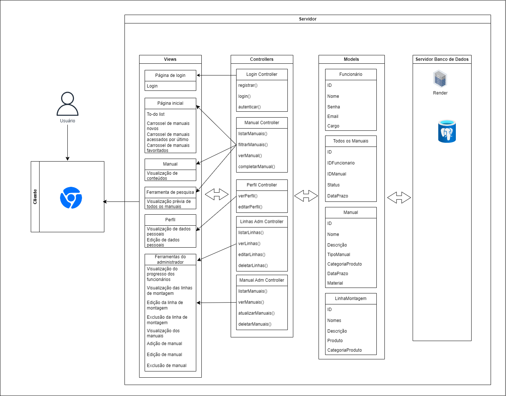

# Arquitetura MVC do Edellcation

&nbsp;&nbsp;&nbsp;&nbsp;O Edellcation é uma aplicação web de treinamento para divulgar e a disponibilizar materiais técnicos (manuais) sobre o processo de montagem de diferentes produtos da empresa Dell. A solução foi elaborada conforme a arquitetura MVC (Model-View-Controller), cujo esboço foi produzido com a ferramenta de diagramação _draw.io_.

Figura 1 - Arquitetura 

Fonte: Material elaborado pela autora (2024).

[Diagrama em PDF](assets/MVC.drawio.pdf)

## Padrão MVC

O MVC (Model-View-Controller) é um padrão de arquitetura de software, que separa a lógica de negócios da interface do usuário, facilitando a manutenção e o desenvolvimento de vários tipos de projetos, como, por exemplo, _desktop_, _web_ e _mobile_. As três partes principais do padrão MVC são:

1. **Modelo (Model)**:
   - O modelo é responsável pela lógica de negócios e pela manipulação dos dados. Ele encapsula o comportamento dos dados, incluindo a validação, a manipulação e a persistência.
   - O modelo representa o estado subjacente dos dados, mas não contém qualquer lógica de exibição ou interação com o usuário.
   - Em uma aplicação _web_, o modelo pode ser uma classe que interage com o banco de dados ou com serviços externos para recuperar e manipular os dados.

2. **Visão (View)**:
   - A _view_ é responsável por exibir os dados ao usuário e pela interação com ele. Ela apresenta a interface do usuário e recebe as entradas do usuário.
   - Não contém lógica de negócios; apenas formata e exibe os dados fornecidos pelo modelo.
   - Em uma aplicação _web_, a _view_ geralmente é uma página HTML, uma interface gráfica de usuário ou uma parte da interface de usuário que renderiza os dados.

3. **Controlador (Controller)**:
   - O controlador atua como intermediário entre o modelo e a visão. Ele responde às entradas do usuário e executa as operações necessárias, como atualizar o modelo e selecionar a visão apropriada para exibir.
   - O controlador interpreta as ações do usuário (como cliques em botões ou submissão de formulários) e decide como responder a essas ações.
   - Em uma aplicação web, o controlador pode ser um script ou uma classe que recebe requisições HTTP, interage com o modelo para processar os dados e, em seguida, seleciona a visão apropriada para enviar ao cliente.

Ao adotar o padrão MVC, as responsabilidades de cada componente são claramente definidas, o que facilita a manutenção, o teste e a escalabilidade. Além disso, o MVC promove a reutilização de código, já que as diferentes camadas são independentes umas das outras.

## MVC no Edellcation

### Modelos (Models):
1. **Funcionário:**
   - **ID:** Identificador único do funcionário (chave primária).
   - **Nome:** Nome do funcionário.
   - **Senha (criptografada):** Senha criptografada do funcionário para fins de autenticação.
   - **E-mail:** Endereço de e-mail do funcionário.
   - **Cargo:** Cargo do funcionário.

2. **Todos os Manuais:**
   - **ID:** Identificador único do manual (chave primária).
   - **IDFuncionario:** Identificador do usuário associado à tarefa (chave estrangeira referenciando a entidade Funcionário).
   - **IDManual:** Identificador do manual associado à tarefa (chave estrangeira referenciando a entidade Manual).
   - **Status:** _Status_ da tarefa, pendente ou concluída.
   - **Data de atribuição:** Data de atribuição da tarefa e prazo.

3. **Manual:**
   - **ID:** Identificador único do manual (chave primária).
   - **Nome:** Nome do manual.
   - **Descrição:** Descrição do manual.
   - **TipoManual:** Tipo de manual (documento, imagem, vídeo, modelo 3D).
   - **CategoriaProduto:** Categoria e produto ao qual o manual se refere.
   - **DataPrazo:** Data de publicação e prazo.
   - **Material:** Materiais e anexos do manual.

4. **LinhaMontagem:**
   - **ID:** Identificador da linha de montagem (chave estrangeira referenciando a entidade LinhaMontagem).
   - **Nomes:** Nomes dos funcionários da linha de montagem.
   - **Descrição:** Descrição da linha de montagem.
   - **Produto:** Produto montado na linha de montagem.
   - **CategoriaProduto:** Categoria do produto da linha de montagem.

#### Relacionamentos:
- Um manual pode ter muitas tarefas associadas a ele (relação 1 para N entre Manual e TodososManuais).
- Um funcionário pode ter muitas tarefas (relação 1 para N entre Funcionário e TodososManuais).
- Um funcionário pode estar associado a uma ou várias linhas de montagem (relação 1 para N entre Funcionário e LinhaMontagem).

### Controladores (Controllers):
#### Login Controller
- **registrar(nome: string, email: string, senha: string, tipoUsuario: string)**: Registra um novo usuário.
  - Entrada: `nome`, `email`, `senha`, `Cargo`
  - Saída: Mensagem de sucesso ou erro, detalhes do usuário registrado.
  - **login**: Loga o usuário.
  - **autenticar**: Autenticação do usuário.
  
  O Login Controller gerencia as operações de autenticação e registro de usuários, interagindo com o modelo de Funcionário para registrar novos usuários e validar credenciais de acesso.

#### Manual Controller (Controlador de Manual)
- **listarManuais(filtro: object)**: Lista todos os manuais disponíveis com opção de filtragem.
  - Entrada: `filtro` (objeto contendo critérios de filtragem)
  - Saída: Lista de cursos.
- **filtrarManuais(criterios: object)**: Aplica filtros específicos à lista de manuais.
  - Entrada: `criterios` (objeto contendo critérios de filtragem)
  - Saída: Lista de manuais filtrados.
- **verManual(IDManual: int)**: Exibe detalhes completos de um manual.
  - Entrada: `IDManual`
  - Saída: Detalhes do manual.
- **completarManual(IDManual: int, IDFuncionario: int)**: Marca um manual como concluído.
  - Entrada: `IDManual`, `IDFuncionario`
  - Saída: Status do manual atualizado.

  O Manual Controller gere os manuais existentes, permitindo a listagem, filtragem e visualização detalhada. Interage com o modelo de Manual.

#### Perfil Controller (Controlador de Perfil)
- **verPerfil(IDFuncionario: int)**: Exibe o perfil do usuário.
  - Entrada: `IDFuncionario`
  - Saída: Detalhes do perfil do usuário.
- **editarPerfil(IDFuncionario: int, novosDados: object)**: Permite ao usuário editar seu perfil.
  - Entrada: `IDFuncionario`, `novosDados` (objeto contendo os campos editáveis)
  - Saída: Perfil atualizado.

  O Perfil Controller permite a visualização e edição de perfis. Ele se comunica com o modelo de Funcionário para acessar e atualizar informações de perfil.

#### Linhas Adm Controller (Controlador de Linhas de Montagem)
- **listarLinhas()**: Lista todas as linhas de montagem.
  - Entrada: Nenhuma
  - Saída: Lista de linhas de montagem.
- **verLinhas(IDLinhaMontagem: int)**: Exibe detalhes de uma linha de montagem.
  - Entrada: `IDLinhaMontagem`
  - Saída: Detalhes da linha de montagem.
- **editarLinhas(IDLinhaMontagem: int, novosDados: object)**: (Admin) Edita uma linha de montagem.
  - Entrada: `IDLinhaMontagem`, `novosDados`
  - Saída: Linha de montagem atualizada.
- **deletarLinhas(IDLinhaMontagem: int)**: Remove uma linha de montagem.
  - Entrada: `IDLinhaMontagem`
  - Saída: Confirmação de remoção.

  O Linhas Adm Controller permite que o administrador controle as linhas de montagem existentes. Ele interage com o modelo de LinhaMontagem para acessar e manipular informações sobre as linhas de montagem.

#### Manual Adm Controller (Controlador Adm de Manual)
- **listarManuais(IDFuncionario: int)**: Lista todas os manuais associados ao usuário.
  - Entrada: `IDFuncionario`
  - Saída: Lista de manuais.
- **verManuais(IDManual: int)**: Exibe detalhes de um manual específico e sobre quando foi designado ao usuário.
  - Entrada: `IDManual`
  - Saída: Detalhes do manual designado ao usuário.
- **utualizarManuais(IDManuais: int, novoStatus: string)**: Atualiza o status de um manual.
  - Entrada: `IDManual`, `novoStatus`
  - Saída: Status do manual atualizado.

  O Manual Adm Controller gerencia os manuais atribuídas aos usuários, possibilitando a listagem, visualização e atualização do status de cada manual. Ele se conecta ao modelo de TodosOsManuais para acessar e modificar os manuais associadas aos usuários.

### Views (Views):
- Página de login:
   - Função: Permite login na aplicação e cadastro de novos usuários.
   - Campos para entrada de e-mail, senha e opção de registro.
- Página inicial:
   - Função: Exibir uma visão geral dos manuais disponíveis, pendências e _to-do list_ do usuário, manuais recentemente acessados e manuais favoritados.
- Manual:
   - Função: Mostrar detalhes de um manual específico, incluindo materiais de estudo, descrição do manual, categoria do produto, etc.
- Ferramenta de pesquisa:
    - Função: Permitir que o usuário realize a pesquisa de um manual específico e o localize rapidamente.
- Perfil:
   - Função: Exibir informações do perfil do usuário, como nome, e-mail, histórico de manuais concluídos, etc.
   - Pode incluir opções para edição de informações do perfil.
- Ferramentas do administrador:
   - Função: Permitir que os administradores editem linhas de montagem, manuais, acesso dos funcionários, etc.

## Infraestrutura:

- **Banco de Dados PostgreSQL:** Utilizaremos o PostgreSQL para armazenar dados relacionados aos cursos, usuários, tarefas pendentes, estatísticas e outros elementos pertinentes à aplicação.

- **API de Single Sign-On (SSO):** Dada a integração com sistemas internos de Single Sign-On (SSO), será essencial empregar uma API que permita aos usuários autenticarem-se na aplicação utilizando as credenciais de suas contas corporativas.

- **Serviço de Armazenamento de Arquivos:** Para guardar documentos, imagens, vídeos e modelos 3D associados aos cursos, será viável empregar um serviço de armazenamento de arquivos como Amazon S3 ou Google Cloud Storage.

- **Microsserviços e Containers:** Conforme os requisitos não funcionais, o sistema será distribuído em diversos servidores e baseado em microsserviços. Assim, planejamos configurar uma arquitetura de microsserviços utilizando containers, como Docker, e um orquestrador de containers, como Kubernetes, para gerenciar e escalonar os serviços da aplicação.

- **Sistema de Cache:** Para otimizar o desempenho da aplicação, consideraremos a implementação de um sistema de cache para armazenar conteúdos frequentemente acessados, como arquivos e vídeos. Tecnologias como Redis ou Memcached podem ser empregadas para essa finalidade.

- **Serviço de Notificações:** Para enviar notificações aos usuários sobre atualizações nos cursos ou outras informações relevantes, cogitamos integrar um serviço de notificações por e-mail e push, como Amazon SES ou Firebase Cloud Messaging.

- **Serviços de Monitoramento e Log:** Para monitorar o desempenho e a disponibilidade da aplicação, bem como para rastrear eventos e registros, pensamos em integrar serviços de monitoramento e log, como Prometheus e Grafana, ou ELK Stack (Elasticsearch, Logstash, Kibana).

- **Ambiente de Desenvolvimento e Implantação:** Será fundamental configurar um ambiente completo de desenvolvimento e implantação para o projeto, incluindo ferramentas de controle de versão, como Git, e ferramentas de integração contínua e implantação contínua (CI/CD), como Jenkins ou GitLab CI.

### Justificação da escolha de arquitetura
- **Node.js com Sails.js:**
  - Optamos pelo Node.js devido à sua eficiência e escalabilidade para lidar com operações de I/O intensivas, como as requisições HTTP em uma aplicação web.
  - O framework Sails.js complementa o Node.js ao proporcionar uma estrutura MVC robusta e convenções de desenvolvimento que aceleram o processo de criação de API RESTful e integração com o banco de dados PostgreSQL.

  - **Escalabilidade:**
    - Node.js é reconhecido por sua capacidade de lidar com um grande número de conexões simultâneas, tornando a escalabilidade horizontal fácil de ser alcançada para lidar com picos de tráfego.

  - **Manutenção:**
    - A estrutura MVC do Sails.js organiza logicamente as partes da aplicação, facilitando a manutenção do código.
    - A comunidade ativa e os recursos de documentação do Node.js e do Sails.js simplificam a resolução de problemas e a implementação de novos recursos.

  - **Testabilidade:**
    - Node.js é altamente testável, suportando frameworks como Mocha, Jest e Jasmine, enquanto a estrutura MVC facilita a separação de preocupações para testes unitários e de integração.

- **PostgreSQL como Banco de Dados:**
  - Escolhemos o PostgreSQL pela robustez, confiabilidade e capacidade de escalabilidade que oferece.
  - Seus recursos avançados, como transações ACID, índices avançados e suporte a JSON, são especialmente úteis para aplicativos de negócios complexos.

  - **Escalabilidade:**
    - O PostgreSQL é altamente escalável, permitindo que a aplicação cresça conforme a demanda, com estratégias como particionamento de tabelas e replicação para melhorar o desempenho.

  - **Manutenção:**
    - Amplamente utilizado e bem documentado, o PostgreSQL facilita a manutenção e o gerenciamento do banco de dados, com uma comunidade ativa que rapidamente corrige problemas de segurança e bugs.

  - **Testabilidade:**
    - Suporta testes de unidade e integração através de bibliotecas como pgTAP, com a possibilidade de configurar facilmente bancos de dados de teste para garantir a segurança do ambiente de produção.

- **HTML5, CSS3, Bootstrap e JavaScript para Front-end:**
  - Optamos por essas tecnologias devido à familiaridade e ampla adoção, facilitando o desenvolvimento de uma interface de usuário intuitiva e responsiva.

  - **Escalabilidade:**
    - O front-end desenvolvido com essas tecnologias é facilmente escalável, especialmente quando combinado com um backend escalável como o Node.js.

  - **Manutenção:**
    - Simplifica a manutenção, especialmente com boas práticas de organização de código e modularização, e o Bootstrap facilita ao fornecer componentes pré-construídos e estilos consistentes.

  - **Testabilidade:**
    - Altamente testáveis, com suporte para frameworks como Jest, Jasmine e Selenium para testes de unidade, integração e e2e.